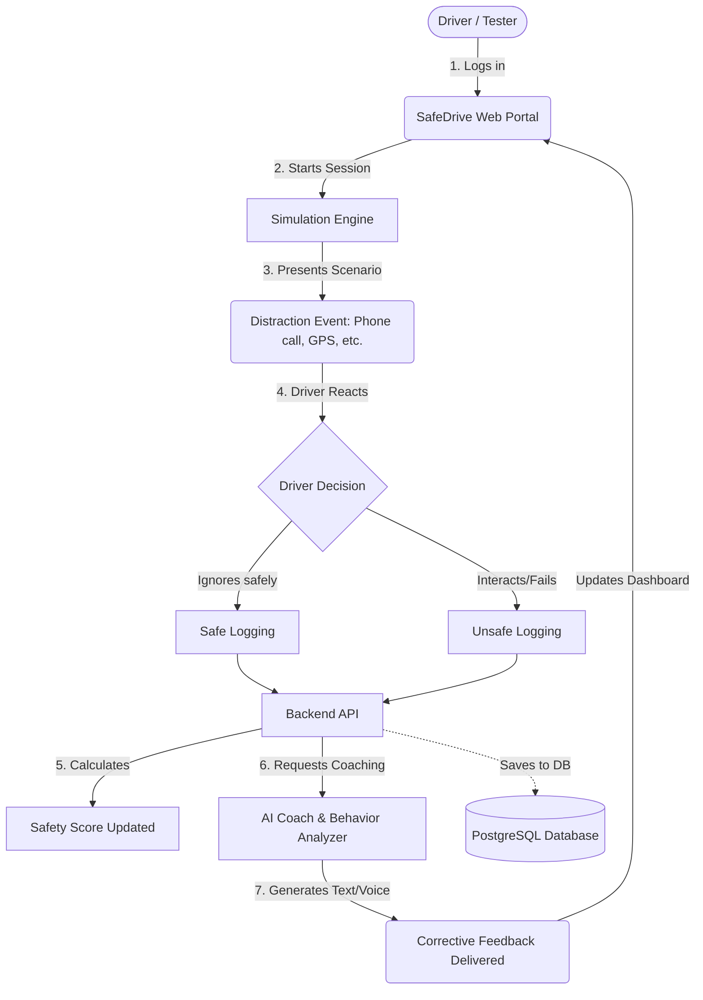

# 🛡️ SafeDrive AI: Project Overview & Testing Guide

Welcome to the **SafeDrive AI** testing phase! This document is designed to help you understand the purpose of the platform, how it works under the hood, and what features are currently active for you to test.

---

## 🎯 What is SafeDrive AI?
SafeDrive AI is a behavioral training platform designed to combat distracted driving. Instead of boring static videos or quizzes, it uses interactive simulations to put drivers in high-pressure scenarios, tracks their reactions in real-time, and provides AI-driven corrective feedback to improve focus and safety on the road.

---

## 🔄 User Journey & Platform Architecture Flowchart
The core loop of our application revolves around giving the user a scenario, tracking their reaction, scoring it, and delivering feedback. 

Here is the flowchart representing the current state of the platform:

---

## 📊 Current Project Status

We have completed the core functionality and the platform is ready for active behavioral testing.

### ✅ What is Currently Working (Ready to Test):
- **User Accounts & Authentication:** You can register, log in, and track your individual progress over time.
- **Interactive Simulations:** The platform can dynamically trigger distraction events (like simulated phone calls or GPS issues).
- **Behavior Tracking:** The system monitors your reaction times and classifies your decisions (e.g., Safe, Hesitant, Impulsive, Risky).
- **Driver Profiling:** After completing sessions, the system categorizes your driving style and identifies weaknesses.
- **AI-Powered Coaching:** The platform uses AI to generate on-the-fly, contextual feedback tailored to your specific mistakes during the simulation.
- **Voice Synthesis:** Feedback is delivered via high-quality Text-to-Speech (TTS) using custom voice profiles.

### 🚧 What is Coming Next (Not in this test):
- **Gamification:** Leaderboards, XP tracking, and badges.
- **Mobile Application:** A native iOS/Android experience.
- **Advanced Dashboard for Fleet Managers:** To oversee multiple drivers at once.

---

## 📝 How to Test & Give Feedback

As a tester, your experience is critical to improving the AI's accuracy and the platform's usability. 

1. **Simulate Real Conditions:** When you are taking the simulation, treat the distractions as you would in the real world. If you normally glance at your phone, do so.
2. **Review Your Feedback:** Read and listen to the AI coaching. Is it accurate? Does it feel helpful or annoying?
3. **Report Issues:** If you encounter bugs, slow loading times (especially with voice feedback), or if the system misinterprets a safe action as risky, please note what scenario you were in.
4. **Submit Feedback:** Use the built-in feedback module to log any issues, suggestions, or UI/UX improvements. Your feedback is sent directly to our development team.

> [!TIP]
> **To the testers:** Don't try to be perfect! Making mistakes during the simulation helps us verify that our AI coaching is triggering correctly and providing valuable advice.
