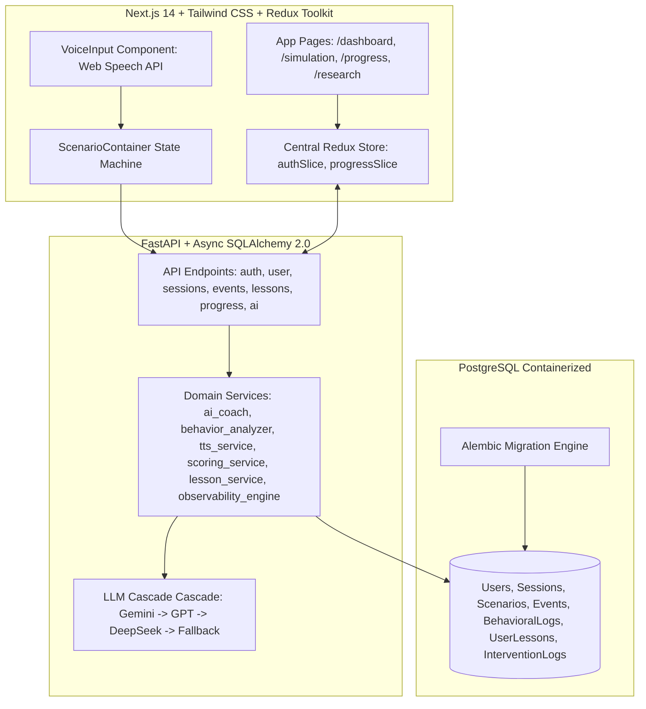

# 🛡️ SafeDrive AI — Project Summary & Engineering Roadmap

This document provides a comprehensive overview of the current implementation state of **SafeDrive AI** (AI-Powered Distracted Driving Platform MVP). It highlights the system architecture, verified/completed features, known limitations, and a prioritized engineering plan for the next development phase.

---

## 1. System Architecture Review

SafeDrive AI is built using a modern, asynchronous, containerized full-stack architecture:



### Key Technical Pillars
* **Frontend Stack**: Next.js 14, TypeScript, Tailwind CSS, Framer Motion (premium animations), Redux Toolkit (global state management).
* **Backend Stack**: FastAPI (Python), SQLAlchemy 2.0 (fully async via `aiosqlite`/`asyncpg`), Pydantic v2.
* **Storage Stack**: PostgreSQL (for production/Docker environments) and SQLite (for local development) with schema migrations authoritatively managed via Alembic.
* **AI Orchestration**: Direct async HTTP cascade for LLM completions (Gemini, OpenAI, DeepSeek) + ElevenLabs API for text-to-speech feedback with local caching.

---

## 2. Feature Completion Matrix

The platform is mature (~85% complete for the core web portal) and implements the following features:

| Feature Area | Status | Implementation Details |
| :--- | :--- | :--- |
| **Authentication** | ✅ Complete | JWT-based secure signup, login, and `/me` routes with `bcrypt` password hashing. Includes a developer-bypass mode (`Bypass (Dev Test)`) to speed up frontend testing. |
| **Driving Simulation Engine** | ✅ Complete | Dynamic state-machine controlled scenario engine (`IDLE` \| `EVENT_ACTIVE` \| `DECISION_PENDING` \| `COACHING_ACTIVE` \| `SESSION_COMPLETE`). Fully prevents event overlapping, double-click spam, and audio bleed-over. |
| **Voice Input Interface** | ✅ Complete | `VoiceInput.tsx` implements the Web Speech API directly in the browser to map spoken decisions ("yes", "no", "look", "ignore") to simulated driver reaction inputs. |
| **Adaptive Difficulty** | ✅ Complete | Dynamic difficulty factor (0.2 to 0.9) that recalculates after each event based on rolling session history, adjusting spawn time delays (with ±30% variance to remove robotic pacing). |
| **Scoring & Event Logging** | ✅ Complete | Backend computes reaction score deltas based on response speed and distraction severity, persisting granular event logs (`Event`) and session statuses (`Session`). |
| **Driver Profiling** | ✅ Complete | `behavior_analyzer.py` classifies driver behavior types (`IMPULSIVE`, `DISTRACTED`, `HESITANT`, `INCONSISTENT`, `SAFE`) dynamically on session completion using running ratio and response-time statistics. |
| **AI Social Pressure & Coaching** | ✅ Complete | `ai_coach.py` generates real-time passenger distraction text/speech during simulation events and safety training recommendations immediately afterward. Cascades through `Gemini Flash 2.0` ➔ `GPT-4o-mini` ➔ `DeepSeek` ➔ local hardcoded pools. |
| **Voice Synthesis (TTS)** | ✅ Complete | ElevenLabs API using `eleven_flash_v2_5` with custom voice profiles (Casual Passenger, Calm Instructor, Rigid Authority). Wrapped in a thread-safe in-memory cache to prevent redundant synthesis costs. |
| **Lessons System** | ✅ Complete | Both static curriculum modules (e.g. 2-Second Rule) and dynamic AI-personalized lessons generated on-the-fly (`UserLesson` model) are fully functional on the frontend (`/lessons`) and backend routes. |
| **Research & Observability** | ✅ Complete | `observability_engine` computes research-grade telemetry: *Unsafe Decision Reduction %*, *Average Hesitation Recovery Time*, *Authority Success Rate*, and the *Intervention Fatigue Index*. Shown in a dedicated `/dashboard/research` UI. |
| **Mobile Integration** | ❌ Missing | Staged for a future phase (no React Native or Expo structure established). |
| **Gamification** | ❌ Missing | Badge achievement, XP tracking, and user leaderboards are currently not present. |

---

## 3. Database Schema Overview

```mermaid
erDiagram
    users {
        string id PK
        string name
        string email UNIQUE
        string hashed_password
        enum profile_type
        datetime created_at
    }
    sessions {
        string id PK
        string user_id FK
        float score
        datetime start_time
        datetime end_time
    }
    scenarios {
        string id PK
        string name
        text description
        enum distraction_type
        string difficulty_level
        text instruction_text
    }
    events {
        string id PK
        string session_id FK
        enum event_type
        enum user_response
        float response_time
        datetime triggered_at
    }
    behavioral_logs {
        string id PK
        string session_id FK
        enum decision_type
        string pattern_flags
        boolean is_risky
    }
    user_lessons {
        string id PK
        string user_id FK
        string title
        text behavioral_target
        text ai_coaching_advice
        text exercises
        string difficulty
        boolean completed
    }

    users ||--o{ sessions : starts
    users ||--o{ user_lessons : assigns
    sessions ||--o{ events : logs
    sessions ||--o{ behavioral_logs : records
```

---

## 4. Current Technical Debt & Breakpoints

To ready the MVP for beta testing or deployment, the following areas require optimization:

1. **Authentication Security**: JWT access tokens are stored in local variables / Redux and persisted in browser storage. They should be migrated to `HttpOnly`, `Secure`, `SameSite=Lax` cookies to prevent XSS credential stealing.
2. **Audio Payload Latency**: ElevenLabs text-to-speech returns Base64-encoded audio strings directly in the JSON response payload. This causes larger transfer payloads and increased latency.
3. **API Rate Limiting**: The AI generation endpoints (`/api/ai/pressure` and `/api/ai/feedback`) interact directly with external APIs (Gemini, ElevenLabs). Without rate limiting, the platform is vulnerable to cost scraping or DDoS.
4. **Offline Seeding Validation**: Static curriculum lessons in `lesson_service.py` are hardcoded, but static scenarios rely on startup database execution. Moving all seed configuration to structured migration scripts ensures environment consistency.

---

## 5. Recommended Engineering Roadmap (Next Steps)

Ranked by impact-to-effort ratio, here are the proposed priorities for the next stage of development:

### 🔴 Phase 1: Security & Cost Protection (High Priority)
* **Goal**: Harden backend entry points and prevent API cost abuse.
* **Tasks**:
  1. Refactor auth routes (`routes/auth.py`) to set JWT tokens in `HttpOnly` secure cookies.
  2. Implement backend endpoint rate-limiting (e.g. using `slowapi` or custom FastAPI middleware) on auth and AI endpoints.

### 🟠 Phase 2: User Experience & Latency Optimization (Medium Priority)
* **Goal**: Improve speech synthesis response speed in the simulation screen.
* **Tasks**:
  1. Migrate the voice generation flow from Base64 JSON payloads to direct response streaming (FastAPI `StreamingResponse`) or leverage CDN pre-signed URL storage for repetitive audio prompts.
  2. Optimize the ElevenLabs in-memory cache to persist across server restarts (e.g., using Redis or a local SQLite key-value store).

### 🟡 Phase 3: Curriculum Enrichment & Gamification (Lower Priority)
* **Goal**: Expand content diversity and increase user retention.
* **Tasks**:
  1. Add new interactive scenario seeds (e.g. low-visibility driving, animal hazards, high-distraction passenger arguments) to the default database seed list.
  2. Bootstrap user gamification elements (e.g., driver streaks, badges for "Focus Champion" or "Safe Driver", XP points) in the database models and frontend dashboard.
